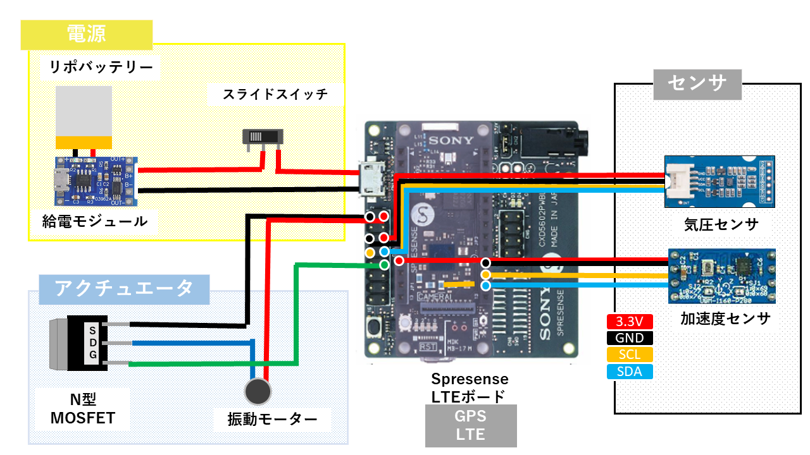
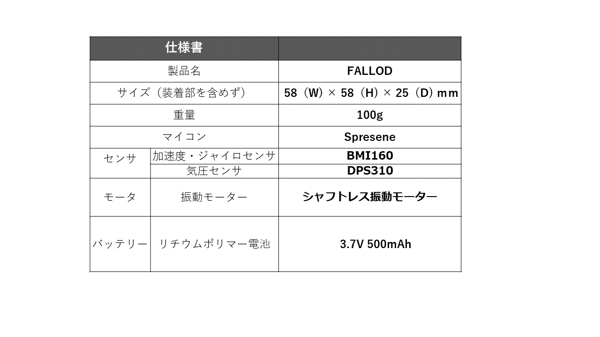

# Fallod

## 製品について
本製品は転倒検知・ユーザーへの通知を行うデバイスになります。

ただし、このデバイスはGPS機能を用いているので基本的に屋外のみで使用可能です。

## ビルド
1.SPRESENSEのArduinoプロジェクトがビルドできる状態にします(詳細はSonyのSPRESENSE公式ページをご覧ください)。

2.ArudinoIDEでcompleted formフォルダにあるLteHttpSecureClient2.inoとSub1.inoを開いてください。

3.SPRESENSEをPCに接続します。

4.LteHttpSecureClient2.inoをMAINCORE上で、Sub1.inoをSubCore1上でスケッチをマイコンに書き込みます。

## センサーについて
この製品を扱うにあたって、SPRESENSEとセンサーの接続は以下の画像を参考にしてください。



また、仕様書は以下の通りになります。



## 使い方
スケッチの書き込み、センサーの接続が終わった後はスイッチをONにしてください。

GPSによる座標取得が行われるまで30秒程度かかりますので待機してください。

Fallodはベルトやポケットに装着して下さい。

後は自動的に座標取得をし危険通知・データ取得を行います。

## クラウド側システム・環境要求
- Ubuntu 18.04/20.04
- CPython >= 3.6

## クラウド側インストール方法と使い方
```bash
bash aws/insatll.sh # Install requirement packages and modules

cd aws/backend && python3 server.py # Run the server
```

## 機能
本製品の機能は以下の通りです。

・SPRESENSEの高い精度のGNSSを用いた座標取得

・センサーの組み合わせによる転倒検出

・地図上への座標記録

・ユーザーへの危険通知
